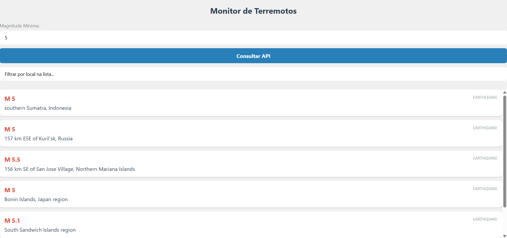

# Monitor de Terremotos - React Native

Este projeto é um aplicativo desenvolvido em React Native para a disciplina de Desenvolvimento Móvel. O objetivo principal é consumir dados em tempo real de uma API externa e exibir informações geológicas de forma organizada para o usuário.

## API Utilizada
Foi utilizada a **USGS Earthquake Catalog API**, que fornece dados atualizados sobre sismos ao redor do mundo em formato GeoJSON.

## Funcionalidades
- **Consulta Dinâmica:** O usuário pode definir a magnitude mínima diretamente no app, alterando os parâmetros da requisição à API.
- **Busca Local:** Filtro em tempo real para encontrar locais específicos dentro da lista já carregada.
- **Tratamento de Estados:** Exibição de um indicador de carregamento (spinner) e mensagens amigáveis em caso de erro de conexão.
- **Interface Responsiva:** Uso de componentes nativos para garantir uma boa experiência em diferentes dispositivos.

### Visualização da Aplicação

## Componentes Utilizados (Além dos básicos)
Para cumprir os requisitos do projeto, foram explorados os seguintes componentes extras:
1. **FlatList:** Para renderização eficiente da lista de terremotos.
2. **ActivityIndicator:** Para dar feedback visual de carregamento ao usuário.
3. **TextInput:** Utilizado para a entrada de dados (magnitude e busca local).
4. **TouchableOpacity:** Para criação de botões personalizados e interativos.
5. **SafeAreaView:** Para garantir que o conteúdo respeite os limites físicos da tela (como o notch).

## Uso de Inteligência Artificial
Conforme as diretrizes acadêmicas, a IA foi utilizada como suporte para:
- Estruturação da função assíncrona `fetch` e manipulação do JSON.
- Implementação da lógica de filtro em tempo real no `FlatList`.
- Correção de sintaxe em Template Strings para URLs dinâmicas.
- Identificação de componentes extras para melhoria da interface.

## Como rodar o projeto
1. Clone este repositório.
2. Instale as dependências: `npm install`.
3. Inicie o Expo: `npx expo start`.
4. Escaneie o QR Code com o app Expo Go.

---
**Desenvolvido por:** Isaias Maia de Oliveira